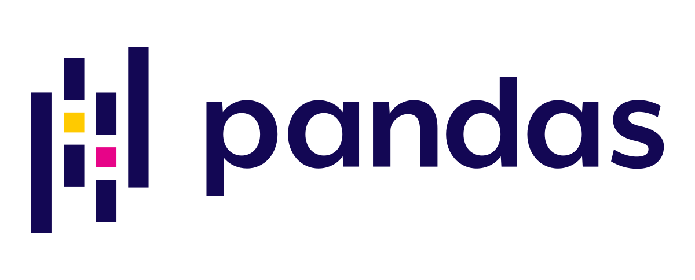
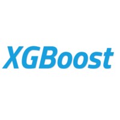
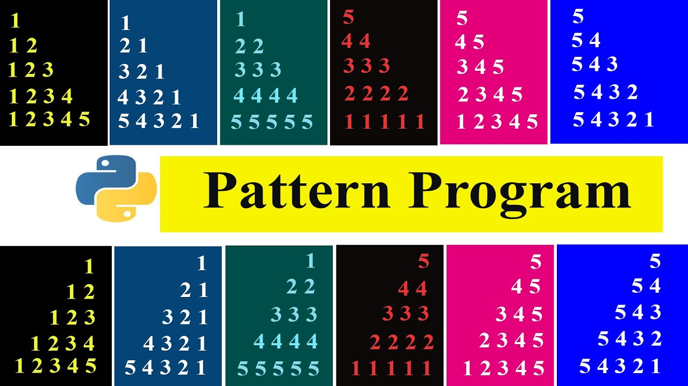
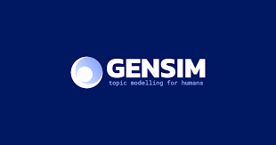

## ***Librerias y Framework de python***
## usos en analisis de datos 
## - **Matplotlib:** 
Es una biblioteca de trazado para Python, lo que significa esencialmente que se utiliza para crear visualizaciones estáticas, animadas e interactivas. Fue desarrollada para eliminar la necesidad del lenguaje estadístico MATLAB y funciona como una unidad de NumPy y SciPy. La biblioteca puede crear gráficos con calidad de publicación y se basa en la interfaz gráfica de Python para trazarlos con API orientadas a objetos.

## - **TensorFlow:** 
Creada por el equipo de Google Brain en 2015, TensorFlow es la biblioteca de código abierto más famosa para construir aplicaciones de aprendizaje profundo/deep learning. Especializada en programación diferencial y redes neuronales, el repositorio permite a principiantes y profesionales construir y diseñar algoritmos utilizando CPUs y GPUs.

## - **Pandas:** 
proporciona herramientas que permiten: leer y escribir datos en diferentes formatos: CSV, Microsoft Excel, bases SQL y formato HDF5. seleccionar y filtrar de manera sencilla tablas de datos en función de posición, valor o etiquetas. fusionar y unir datos.

## - **NumPy:** 
Creada en 2015, NumPy o Numerical Python, es una de las bibliotecas clave para la computación matemática y científica. Gracias a su capacidad para realizar diversas operaciones matemáticas como el álgebra lineal, la transformada de Fourier y las funciones de cálculo de matrices, es muy utilizada por los científicos para analizar datos. NumPy también se utiliza para aumentar el rendimiento de los modelos de Machine Learning sin mucha complejidad y requiriendo mucho menos almacenamiento con matrices multidimensionales.

## - **Plotly:** 
es una biblioteca de visualización de datos en Python que permite crear gráficos interactivos y personalizados para explorar y representar datos de manera efectiva.

## - **Scikit-learn:** 
Construido sobre SciPy, NumPy, y Matplotlib, Scikit-learn cuenta con refuerzo de gradiente, soporte para máquinas vectoriales, y bosques aleatorios para la regresión, la clasificación y la agrupación. Se utiliza para la minería de datos y las aplicaciones convencionales de machine learning. Sus principales características incluyen la inferencia de información a partir de datos de imágenes y textos y la fusión de predicciones de modelos supervisados utilizando ensamble de modelos.

## - **PyTorch:** 
Basado en Torch, un framework del lenguaje de programación en C, PyTorch es una biblioteca de código abierto de Python para crear gráficos computacionales modificables en tiempo real. Es muy popular entre los científicos de datos y los entusiastas del aprendizaje automático que construyen aplicaciones basadas en la PNL(procesamiento de lenguaje natural) o la visión por ordenador.

## - **Keras:** 
Construido para la prueba rápida de redes neuronales profundas, Keras es una interfaz de librería de código abierto de TensorFlow. Permite a los desarrolladores construir modelos, analizar conjuntos de datos y visualizar gráficos. También se ejecuta sobre ‘Theano‘, lo que permite el entrenamiento de redes neuronales con muy poco código. Al ser altamente escalable y flexible, es utilizado por organizaciones como la NASA y Alphabet, entre otras.

## - **XGBoost:** 
Es una librería de refuerzo de gradiente distribuida, optimizada para crear algoritmos de machine learning utilizando su algoritmo de potenciación de árbol paralelo para abordar diversos problemas de ciencia de datos de forma precisa y rápida. La biblioteca, además de estar en Python, también está disponible en R, Julia, C++, Java y Scala.

## - **SciPy:** 
Es otra biblioteca de aprendizaje automático utilizada activamente y construida para trabajar con matrices NumPy, SciPy se utiliza para la computación científica y técnica de grandes conjuntos de datos. Se utiliza para la visualización y manipulación de datos y está considerada como una de las mejores para el análisis científico. Se considera un repositorio más fácil de usar que NumPy.

## ***FRAMEWORKS***
## - **NLTK:** 
Natural Language Toolkit es una plataforma completa que contiene más de 50 corpus y recursos léxicos, como WordNet. Además de esto, también proporciona las herramientas, interfaces y métodos necesarios para procesar y analizar datos de texto. El marco NLTK viene con un conjunto de módulos eficientes para clasificación, tokenización, derivación, lematización, etiquetado, análisis y razonamiento semántico. Es el caballo de batalla estándar de cualquier proyecto de PNL en la industria.

## - **pattern:** 
El proyecto de pattern se utilizo mucho en la versión de Python 2.x, más apun no existe una versión de Python 3.x. Esto comenzó como un proyecto de investigación en el Centro de Investigación de Lingüística Computacional y Psicolingüística de la Universidad de Amberes. Proporciona herramientas e interfaces para minería web, recuperación de información, procesamiento de lenguaje natural, aprendizaje automático y análisis de redes.

## - **spaCy:**  
Esta es una de las bibliotecas recientes en comparación con las demás, pero quizás una de las mejores bibliotecas para NLP. Podemos dar fe del hecho de que spaCy proporciona capacidades de procesamiento de lenguaje natural de fuerza industrial al proporcionar la mejor implementación de cada técnica y algoritmo, lo que hace que las tareas de PNL sean eficientes en términos de rendimiento e implementación. De hecho, spaCy sobresale en tareas de extracción de información a gran escala. Ha sido escrito desde cero utilizando Cython eficiente y administrado por memoria. Una extensa investigación también ha confirmado que spaCy es el más rápido del mundo. spaCy también funciona a la perfección con frameworks de aprendizaje profundo y aprendizaje automático como TensorFlow, PyTorch, Scikit-Learn, Gensim y el resto del excelente ecosistema de inteligencia artificial de Python. ¡La mejor parte es que spaCy tiene soporte para varios idiomas y proporciona vectores de palabras previamente entrenados!

## - **gensim:** 
La biblioteca gensim tiene un amplio conjunto de capacidades para el análisis semántico, incluido el modelado de temas y el análisis de similitudes. Pero la mejor parte es que contiene un puerto Python del muy popular modelo Word2Vec de Google (originalmente disponible como paquete C), que es un modelo de red neuronal implementado para aprender representaciones distribuidas de palabras donde palabras similares (semánticas) ocurren cerca unas de otras. Por lo tanto, Gensim se puede utilizar para análisis semántico y para ingeniería de características.

## - **textblob:** 
Esta es otra biblioteca que proporciona varias capacidades, que incluyen procesamiento de texto, extracción de frases, clasificación, etiquetado POS, traducción de texto y análisis de opiniones. TextBlob facilita muchas cosas difíciles, incluida la traducción de idiomas y el análisis de sentimientos, gracias a su API extremadamente intuitiva y fácil de usar.
